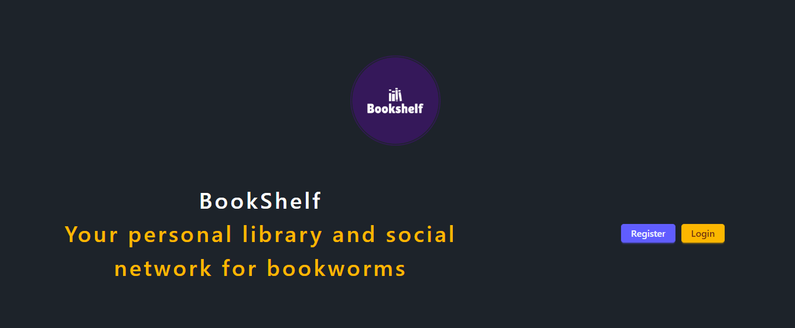
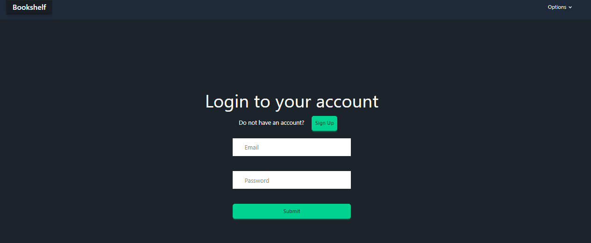
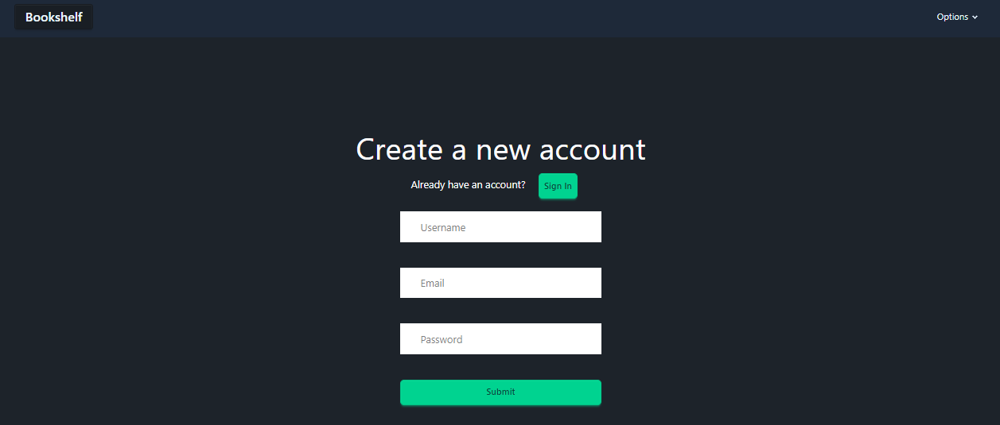
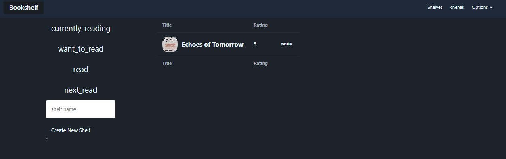
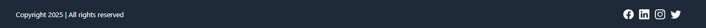
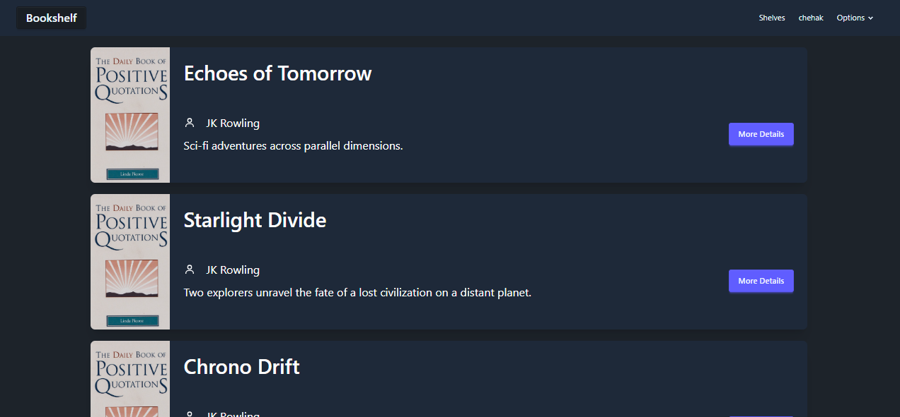

# 📚 GoodReads Clone – Book Management App

A responsive web application inspired by GoodReads, where users can sign up, log in, explore books, organize them into shelves, and manage their reading journey via a personalized dashboard.

---

## 🚀 Features

- 🔐 **Authentication**: Sign up and Sign in with secure login.
- 🏠 **Home Page**: Browse a collection of books after logging in.
- 📚 **Shelves**:
  - View categorized shelves: *Currently Reading*, *Want to Read*, and *Read*.
  - Add more book shelves.
- 🧭 **Dashboard**: Navigate across pages and manage your reading activity.
- 🔓 **Logout**: End session securely from the dashboard.

---

## 🖼️ Screenshots

> 📁 Store all screenshots inside a `screenshots/` folder in the root of your project

| Home | Sign Up | Sign In |
|--------|---------|------|
| |  |  |

| Shelves | Footer | Dashboard |
|--------|--------------|-----------|
|  |  |  |

---

## 🛠️ Tech Stack

**Frontend:**
- React.js
- Redux Toolkit
- React Router DOM
- Tailwind CSS 

**Libraries & Tools:**
- Axios
- React Toastify (for notifications)

---

## 📦 Installation & Setup

1. **Clone the repository**

```bash
git clone https://github.com/Chehak5911/goodreads-clone.git
cd goodreads-clone

2. **Install dependencies**

```bash
npm install

3. **Set up environment variables**
Create a .env file in the root directory and add the following:

```bash
VITE_BACKEND_URL=http://localhost:3005/api/v1/

3. **Start the deployment server**

```bash
npm run dev

## ✍️ Author
**Chehak Batra**  
[GitHub](https://github.com/Chehak5911) · [LinkedIn]([https://linkedin.com/in/your-profile](https://www.linkedin.com/in/chehak-batra5911/)


